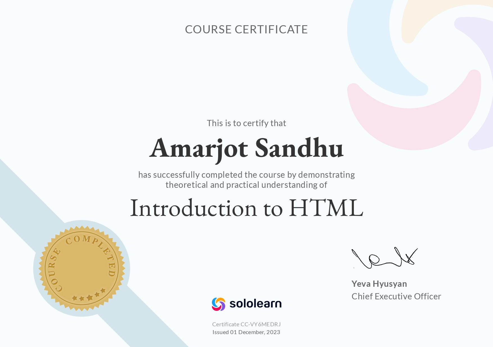

# Portfolio Website

This repository contains the code for my portfolio website. It showcases my skills, projects, and contact information.

## Overview

The website consists of several sections:

- **Profile**: Displays a brief introduction, profile picture, and links to my resume and social profiles.
- **About**: Provides details about my background, education, and a summary of myself.
- **Experience**: Highlights my technical skills and proficiency in various programming languages.
- **Projects**: Showcases some of my recent projects along with links to their GitHub repositories.
- **Contact**: Provides contact information to get in touch with me.

## Screenshots

Here is a screenshot of the website:

## Technologies Used

- HTML
- CSS
- JavaScript

## How to Run Locally

1. Clone this repository to your local machine.
2. Open the project folder in Visual Studio Code.
3. Use the Live Server extension or any other local server extension to launch the `index.html` file.
4. The website should open in your default browser.

## Acknowledgments

A shoutout to [SoloLearn](https://www.sololearn.com/) for the Introduction to HTML certificate course that helped kickstart this project.

Both SoloLearn and "How to Become a Developer" played a big roll in helping me learn how to make websites.

Feel free to explore the code and reach out for any inquiries or collaborations!
